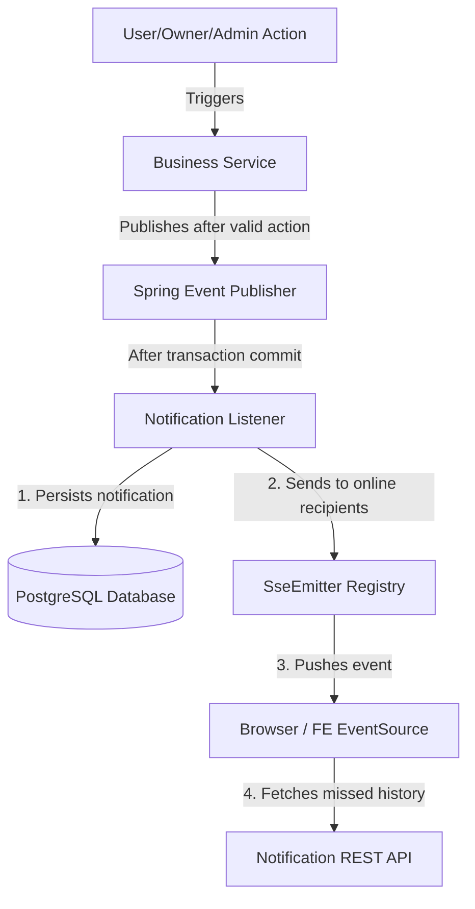

# System Design Document: Notification System for ChayNow

This document outlines the proposed architecture, database schema, event flows, API design, implementation roadmap, and design review notes for the system-wide notification feature in ChayNow.

This is a design proposal; no application code has been modified or implemented yet.

---

## 1. System Architecture

To keep business modules loosely coupled, the backend should use an event-driven notification flow. Business services publish domain notification events after important actions happen, and a notification module handles persistence and real-time delivery.

Recommended implementation for the current ChayNow scale:

- Use Spring Boot `ApplicationEventPublisher` for in-process events.
- Use `@TransactionalEventListener(phase = TransactionPhase.AFTER_COMMIT)` so notifications are created only after the business transaction succeeds.
- Use `@Async` with an explicitly configured `TaskExecutor` if event handling should not block the original request.
- Use Server-Sent Events (SSE) for real-time delivery to logged-in users.
- Persist every notification before attempting real-time push, so users can still fetch missed notifications later.



### Why Server-Sent Events (SSE)?

- **Simple fit for notifications**: The server pushes updates to clients; clients do not need full duplex messaging.
- **Browser-native reconnection**: `EventSource` can reconnect automatically.
- **Lower operational overhead**: No RabbitMQ, Kafka, Redis Pub/Sub, or WebSocket gateway is required for the first version.
- **Works well with persisted history**: If the connection drops, the frontend can reload unread notifications through the REST API.

### Important SSE Constraints

- Native browser `EventSource` cannot set custom `Authorization` headers.
- Prefer authenticating the stream with an HTTP-only secure cookie if the FE and BE deployment model supports it.
- If a query token must be used, make it a short-lived, notification-stream-only token. Do not pass the normal long-lived access token in the URL because URLs can appear in logs, browser history, and monitoring tools.
- Keep one active SSE emitter per user session or browser tab, and clean it up on completion, timeout, and error.
- Configure heartbeat events so proxies and browsers do not silently close idle streams.

---

## 2. Database Schema

The system should store notification history in a `notifications` table. A `notification_settings` table can be added when users need to control which notification types they receive.

### `notifications` Table

| Column Name | Data Type | Constraints | Description |
| :--- | :--- | :--- | :--- |
| `id` | `UUID` or `BIGINT` | Primary Key, Auto-generated | Unique identifier of the notification. |
| `recipient_id` | `BIGINT` | Foreign Key (`users.id`), indexed | User who receives the notification. |
| `title` | `VARCHAR(255)` | NOT NULL | Short title shown in the notification list. |
| `content` | `TEXT` | NOT NULL | Human-readable message. |
| `type` | `VARCHAR(50)` | NOT NULL, indexed | Notification category used by BE rules and FE rendering. |
| `entity_type` | `VARCHAR(50)` | Nullable | Subject entity type, for example `RESTAURANT`, `DISH`, `REVIEW`, `REPORT`, or `TICKET`. |
| `entity_id` | `VARCHAR(100)` | Nullable | Subject entity identifier used for deep-linking. |
| `action_url` | `VARCHAR(500)` | Nullable | Optional FE route when the link cannot be derived from `type` and entity fields alone. |
| `metadata` | `JSONB` | Nullable | Optional structured data such as restaurant name, reviewer name, rating value, or report reason. |
| `is_read` | `BOOLEAN` | DEFAULT FALSE, indexed | Read/unread status. |
| `created_at` | `TIMESTAMP WITH TIME ZONE` | DEFAULT CURRENT_TIMESTAMP, indexed | Timestamp when the notification was generated. |
| `read_at` | `TIMESTAMP WITH TIME ZONE` | Nullable | Timestamp when the notification was marked as read. |

Recommended indexes:

- `(recipient_id, is_read, created_at DESC)` for unread count and notification dropdown queries.
- `(recipient_id, created_at DESC)` for paginated history.
- `(type, created_at DESC)` if admin/reporting screens filter by notification type.

### `notification_settings` Table

This table is optional for the first release, but the schema should be planned early.

| Column Name | Data Type | Constraints | Description |
| :--- | :--- | :--- | :--- |
| `id` | `BIGINT` | Primary Key, Auto-generated | Unique setting row. |
| `user_id` | `BIGINT` | Foreign Key (`users.id`), indexed | Owner of the setting. |
| `type` | `VARCHAR(50)` | NOT NULL | Notification type controlled by this setting. |
| `enabled` | `BOOLEAN` | DEFAULT TRUE | Whether this user wants this notification type. |
| `created_at` | `TIMESTAMP WITH TIME ZONE` | DEFAULT CURRENT_TIMESTAMP | Creation timestamp. |
| `updated_at` | `TIMESTAMP WITH TIME ZONE` | DEFAULT CURRENT_TIMESTAMP | Last update timestamp. |

Add a unique constraint on `(user_id, type)`.

---

## 3. Notification Types (`NotificationType` Enum)

### Customer Types

- `NEW_RESTAURANT`: A new approved restaurant is available to eligible customers.
- `NEW_DISH`: A restaurant followed by the customer published a new dish.
- `ADMIN_USER_NOTICE`: Admin sent a notice related to the user account, ticket, or feedback.

### Owner Types

- `NEW_REVIEW_COMMENT`: A customer left a review or comment on the owner's restaurant.
- `NEW_RATING_STAR`: A customer submitted or updated a star rating.
- `RESTAURANT_STATUS_UPDATE`: Admin approved, rejected, or requested changes for a restaurant listing.
- `ADMIN_OWNER_NOTICE`: Admin sent an instruction or warning to the owner.

### Admin Types

- `USER_REPORT`: A customer reported a review, comment, restaurant, or other content.
- `RESTAURANT_APPROVAL_REQUEST`: An owner submitted a restaurant for verification.

---

## 4. Event Matrix & Distribution Rules

| Triggering Action | Source | Recipient | Notification Type | Entity |
| :--- | :--- | :--- | :--- | :--- |
| Admin approves a new restaurant | Admin | Eligible customers, not necessarily every user | `NEW_RESTAURANT` | `RESTAURANT`, `restaurantId` |
| Owner adds a new dish | Owner | Followers of that restaurant | `NEW_DISH` | `DISH`, `dishId` |
| Admin acts on user account/ticket | Admin | Specific user | `ADMIN_USER_NOTICE` | `TICKET` or null |
| Customer writes a review/comment | Customer | Restaurant owner | `NEW_REVIEW_COMMENT` | `REVIEW`, `reviewId` |
| Customer submits or updates rating | Customer | Restaurant owner | `NEW_RATING_STAR` | `REVIEW` or `RESTAURANT` |
| Owner submits restaurant | Owner | Admin users with approval permission | `RESTAURANT_APPROVAL_REQUEST` | `RESTAURANT`, `restaurantId` |
| Customer reports content | Customer | Admin users with moderation permission | `USER_REPORT` | `REPORT`, `reportId` |
| Admin approves/rejects restaurant | Admin | Restaurant owner | `RESTAURANT_STATUS_UPDATE` | `RESTAURANT`, `restaurantId` |

### Distribution Rules

- Avoid blindly inserting one row for every user when broadcasting `NEW_RESTAURANT`. Start with a smaller eligible audience such as active customers, users in supported locations, or users who opted into discovery notifications.
- For large recipient lists, create notifications in batches.
- Deduplicate notifications when the same business event is retried.
- Check `notification_settings` before creating optional marketing/discovery notifications.
- Security must be enforced on every read/update/delete endpoint: users can only access their own notifications; admins should not automatically see all user notifications unless an explicit admin endpoint is created.

---

## 5. API Endpoint Specifications

### 5.1 Real-Time SSE Stream

- **Endpoint**: `GET /api/v1/notifications/stream`
- **Authentication**:
  - Preferred: HTTP-only secure cookie.
  - Acceptable fallback: short-lived stream token passed as `?streamToken=...`.
- **Response Header**: `Content-Type: text/event-stream`
- **Heartbeat Event**: Send a lightweight heartbeat every 15-30 seconds.
- **Output Sample**:

```http
event: notification
data: {"id":"123e4567-e89b-12d3-a456-426614174000","title":"New Review!","content":"Ngoc Duy left a 5-star review on Restaurant X","type":"NEW_REVIEW_COMMENT","entityType":"REVIEW","entityId":"987","isRead":false,"createdAt":"2026-06-28T15:35:00Z"}
```

### 5.2 Fetch Notification History

- **Endpoint**: `GET /api/v1/notifications`
- **Query Params**: `page=0`, `size=20`, `unreadOnly=false`
- **Headers**: `Authorization: Bearer <token>`
- **Response**:

```json
{
  "content": [
    {
      "id": "123e4567-e89b-12d3-a456-426614174000",
      "title": "New Restaurant Approved",
      "content": "Chay Ngon Restaurant is now open for business!",
      "type": "NEW_RESTAURANT",
      "entityType": "RESTAURANT",
      "entityId": "55",
      "actionUrl": "/restaurants/55",
      "isRead": false,
      "createdAt": "2026-06-28T15:35:00Z",
      "readAt": null
    }
  ],
  "pageable": {},
  "totalPages": 1,
  "totalElements": 1
}
```

### 5.3 Get Unread Count

- **Endpoint**: `GET /api/v1/notifications/unread-count`
- **Headers**: `Authorization: Bearer <token>`
- **Response**:

```json
{
  "count": 7
}
```

### 5.4 Mark Single Notification as Read

- **Endpoint**: `PATCH /api/v1/notifications/{id}/read`
- **Headers**: `Authorization: Bearer <token>`
- **Response**: `204 No Content`
- **Rule**: Only the recipient can mark the notification as read.

### 5.5 Mark All Notifications as Read

- **Endpoint**: `PATCH /api/v1/notifications/read-all`
- **Headers**: `Authorization: Bearer <token>`
- **Response**: `204 No Content`

### 5.6 Delete a Notification

- **Endpoint**: `DELETE /api/v1/notifications/{id}`
- **Headers**: `Authorization: Bearer <token>`
- **Response**: `204 No Content`
- **Rule**: This should be a user-level delete or hide. Consider soft delete if audit history matters.

---

## 6. Implementation Roadmap

### Step 1: Database Setup

1. Create a `Notification` entity matching the schema above.
2. Create `NotificationRepository` extending `JpaRepository`.
3. Add repository methods for:
   - Find by recipient with pagination.
   - Find unread by recipient.
   - Count unread by recipient.
   - Bulk mark as read by recipient.
4. Add database indexes through migration scripts.

### Step 2: Event Infrastructure

1. Define a `SystemNotificationEvent` DTO or record. It does not need to extend `ApplicationEvent` in modern Spring.
2. Include these fields at minimum:
   - `recipientIds`
   - `type`
   - `title`
   - `content`
   - `entityType`
   - `entityId`
   - `actionUrl`
   - `metadata`
   - `deduplicationKey`
3. Implement `NotificationService` for:
   - Validating recipients.
   - Checking notification settings.
   - Persisting notifications.
   - Sending SSE events to online sessions.
4. Implement a `NotificationSseService` or `SseEmitterRegistry` for:
   - Registering emitters by user ID.
   - Removing emitters on timeout, completion, and error.
   - Sending heartbeat events.
5. Add a `@TransactionalEventListener(phase = TransactionPhase.AFTER_COMMIT)` listener.
6. Add `@Async` only after configuring a named executor and logging failures.

### Step 3: Trigger Integrations

Add event publishing inside existing services:

- **Review Service**: Publish event when a review/comment/rating is created or updated.
- **Restaurant Service**: Publish event when a restaurant is submitted, approved, rejected, or needs changes.
- **Dish Service**: Publish event when a followed restaurant adds a dish.
- **Report Service**: Publish event when a report is filed.
- **Admin/User Service**: Publish event when admin sends user or owner notices.

### Step 4: Frontend Integration

1. Add a notification dropdown in the authenticated header.
2. Fetch initial notification history and unread count after login.
3. Open an `EventSource` connection to `GET /api/v1/notifications/stream`.
4. On incoming `notification` events:
   - Add the notification to the dropdown list.
   - Increment unread count.
   - Show a toast when appropriate.
5. On reconnect, refetch unread count and recent notifications to cover missed events.
6. Route notification clicks through `actionUrl` when present; otherwise derive the route from `type`, `entityType`, and `entityId`.

---

## 7. Operational Considerations

- Set a retention policy, for example keep notifications for 90 or 180 days unless audit requirements say otherwise.
- Add logs for failed SSE delivery, but do not treat delivery failure as notification creation failure.
- Add metrics for active SSE connections, delivery failures, notification creation rate, and unread count query latency.
- Rate-limit noisy event sources, especially reports, reviews, and admin broadcast notices.
- For future multi-instance scaling, replace the local emitter registry with Redis Pub/Sub or another shared message layer. Business services should still publish the same domain events.

---

## 8. Design Review Notes

This section records the review findings and the changes applied to make the design more practical.

| Issue Found | Why It Was Not Ideal | Correction Applied |
| :--- | :--- | :--- |
| The original design implied `ApplicationEventPublisher` processes asynchronously by default. | Spring events are synchronous unless an async listener/executor is configured. | Added explicit `@Async` and `TaskExecutor` guidance. |
| Notifications could be created before the main business transaction is committed. | A failed transaction could still leave a notification for an action that never actually happened. | Added `@TransactionalEventListener(phase = AFTER_COMMIT)`. |
| Passing JWT access tokens through SSE query parameters was recommended too casually. | URLs can be logged or stored, exposing tokens. | Recommended HTTP-only cookies first, or short-lived stream tokens as fallback. |
| `target_id` alone was too vague. | The frontend cannot reliably know whether the ID belongs to a restaurant, dish, review, report, or ticket. | Replaced it with `entity_type`, `entity_id`, optional `action_url`, and `metadata`. |
| Broadcast rules such as "All Users" were too broad. | Inserting and pushing to all users can become expensive and noisy. | Changed to eligible users, opt-in settings, and batch creation. |
| The schema missed read timestamp and important indexes. | Notification dropdowns and unread counts need efficient queries and useful audit data. | Added `read_at` plus recipient/read/created indexes. |
| Security ownership rules were not stated. | Users might update or delete notifications that do not belong to them if controller checks are missed. | Added explicit recipient-only access rules. |
| Missed SSE events were not addressed. | SSE can disconnect; real-time delivery is best effort. | Added persisted history, reconnect refetch, unread count endpoint, and heartbeat guidance. |

> [!NOTE]
> This version still intentionally avoids RabbitMQ/Kafka/Redis for the first release. The design is suitable for a single backend instance and can evolve later by replacing the local SSE registry with a shared pub/sub mechanism.
